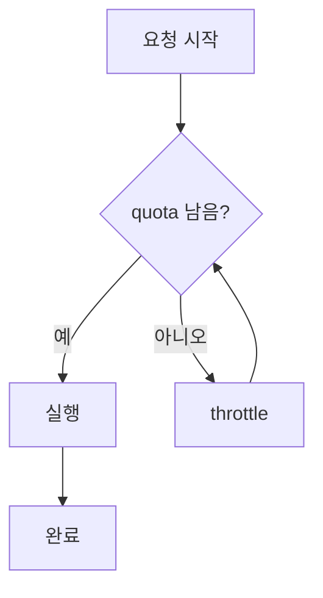
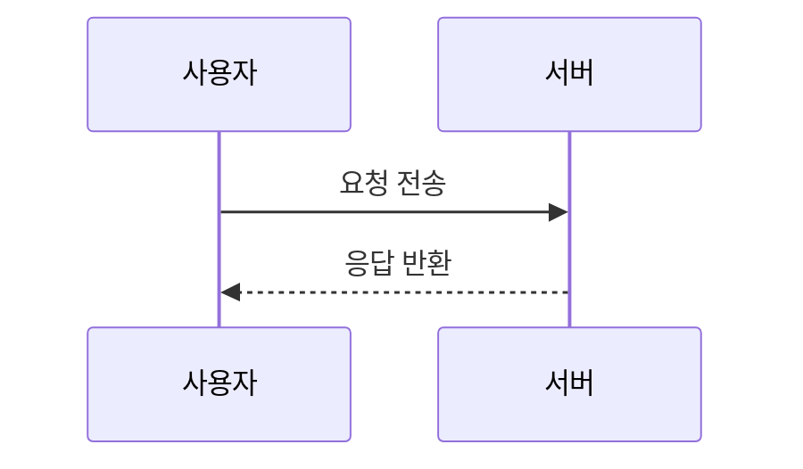

# 수식과 mermaid 테스트

## 블록 수식

전체 처리 시간은 다음과 같이 표현된다.

$$
T_{total} = \sum_{i=1}^{n} \left( t_i + \frac{q_i}{r_i} \right)
$$

위 식에서 $q_i$는 i번째 구간의 quota이고 $r_i$는 리필 속도다.

## 인라인 수식

CPU 사용률은 $u = \frac{q}{p}$ 로 정의되며, 여기서 $p$는 period 길이다. 이 값이 $u > 1$이면 throttle이 발생하지 않는다.

## mermaid 다이어그램

시퀀스 다이어그램도 있다.

## 각주 정의 블록

본문에서 참조하는 각주가 있다[^math-note].

여러 줄에 걸친 각주 정의도 있다[^multiline].

[^math-note]: 이 각주는 수식을 포함한다: $E = mc^2$. 각주 정의 줄 전체가 인라인 kind인 footnote_ref 와는 별개로, 이 정의 줄 자체는 계약서 상 ref_def 처럼 별도 처리되지 않고 일반 산문으로 남을 수도 있다 — 구현이 결정할 부분이지만 최소한 원문 그대로 왕복되어야 한다.

[^multiline]: 첫 번째 줄.
    두 번째 줄도 같은 각주에 속한다.

## 수식과 mermaid가 섞인 마지막 문단

여기까지 $$ 블록 수식과 mermaid 코드펜스, 각주가 모두 등장했다. `--protect-math` 옵션이 꺼져 있으면 수식 부분은 마스킹되지 않고 그냥 산문으로 남아야 하며, 켜져 있으면 math_block/math_inline 으로 토큰화되어야 한다.
